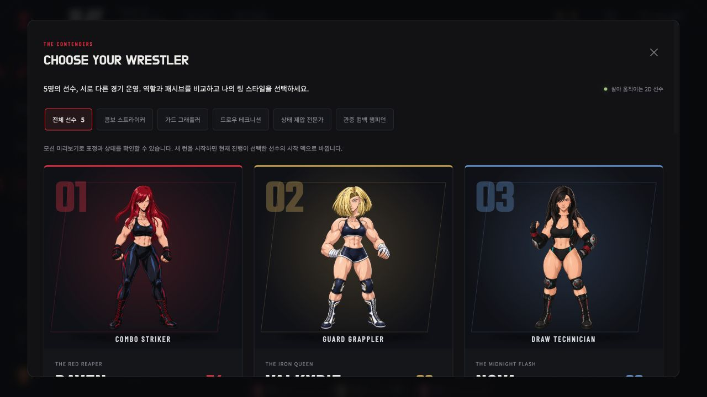
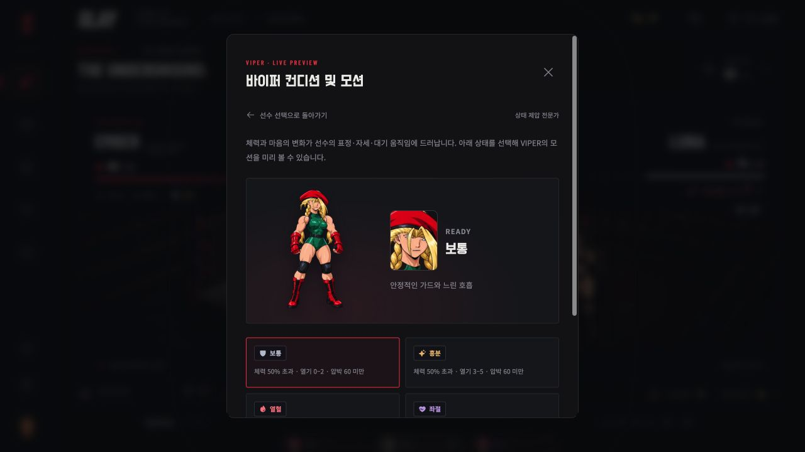

# SLAY | Ring of Nightmares

오리지널 여성 프로레슬링 세계를 배경으로 한 싱글 플레이 덱빌딩 로그라이크 웹게임입니다. 상대의 행동을 읽고 공격과 가드를 연결하며, 관중의 열기로 피니셔를 완성하세요. 심리적 압박은 악몽 카드를 덱에 남깁니다.

[플레이](https://rockyhong-a11y.github.io/slay/) · [카드 도감](https://rockyhong-a11y.github.io/slay/#cards) · [카드 시스템 도움말](https://rockyhong-a11y.github.io/slay/#guide) · [GitHub](https://github.com/rockyhong-a11y/slay) · [게임 설계](docs/GAME_DESIGN.md)



현재 버전은 **시작부터 챔피언십까지 플레이 가능한 버티컬 슬라이스**입니다. 사진 5장의 헤어·의상·체형 특징을 반영해 선수 5명을 새 카툰 셀 셰이딩으로 제작했습니다. 레이븐은 콤보 타격, 발키리는 가드·잡기, 노바는 드로우·순환, 바이퍼는 약화·취약 제압, 엠버는 관중 열기와 컴백을 활용합니다. 각 선수의 11장 시작 덱과 패시브가 실제 전투 규칙에 연결됩니다. 카드 25종, 8개 구간과 최종 보스가 구현되어 있습니다.

각 선수는 새 전신 WebP와 **몸·머리·뒷머리·앞머리·왼팔·오른팔의 6부품 투명 아틀라스**를 가집니다. 6가지 컨디션을 같은 아트의 관절과 표정으로 이어 표현합니다. 이전 사진풍 선수와 15개 상태 포즈는 활성 캐릭터 렌더링에서 교체했습니다.
컨디션은 자동으로 바뀝니다. 체력 25% 이하는 그로기, 25% 초과–50% 이하는 지침을 우선 적용합니다. 체력이 50%를 넘으면 압박 60 이상은 좌절, 열기 6 이상은 열혈, 열기 3–5는 흥분, 나머지는 보통입니다. 선수의 컨디션 배지를 누르면 상태별 기준과 포즈·모션을 미리 볼 수 있습니다.



선수는 분리된 6부품을 부모 관절에 연결한 **자체 Canvas 2D 퍼펫 리그**로 움직입니다. 머리 기울임, 독립 헤어 스프링, 호흡, 양팔 가드·공격, 눈 깜박임·시선·입·눈썹을 표현합니다. 상태 변경은 부드럽게 보간하며, 미리보기는 전신 옆에 얼굴 확대도 보여줍니다. 공격·피격은 실제 큐 ID를 따라 재생하고, 끝난 동작은 화면 복귀 후 반복하지 않습니다. **Live2D 스타일의 자체 구현이며, 네이티브 Cubism `.moc3` 모델은 아닙니다.** 카드 25장은 기존 WebGL 국소 메시 리그를 사용합니다. 두 렌더러가 하나의 공통 프레임 루프에서 동작합니다.
설정의 **일러스트 모션 켜짐/정지**가 전체 아트에 적용됩니다. 운영체제의 모션 감소 설정을 따르고, 화면 밖·열린 창 뒤·숨겨진 탭의 아트는 자동으로 멈춥니다. 카드용 WebGL을 사용할 수 없으면 Canvas 2D로 국소 변형을 그립니다. 선수 리그는 Canvas 2D를 사용합니다.

25종 전용 카드 아트가 기술별 시네마틱으로 재생됩니다. 타격·공중기·던지기·서브미션·잡기·방어·운영·악몽은 서로 다른 움직임을 사용하며, 실제 전투 전후의 피해·방어·회복·드로우·열기·압박 결과를 표시합니다. 재생 중 카드와 턴 종료 입력을 잠가 연속 입력이 겹치지 않게 합니다. 기술 연출은 **전체/간결**로 조절합니다. HUD·선수 무대·설명 영역을 나누고, 기술 시전 중에도 두 선수의 관절 동작을 카드 그림 옆에서 볼 수 있습니다. 데스크톱은 그림과 설명을 두 열에, 모바일은 그림 아래 제목과 결과에 배치합니다.

도감에서 이름과 효과를 검색하고 기술 분류·카드 타입·희귀도로 필터링할 수 있습니다. 상세 창은 전체 동작 그림, 기술 설명, 기본·강화 효과, 소멸 여부와 획득 방법을 함께 보여줍니다. 도움말은 턴 흐름, 카드 더미, 방어와 예고 행동, 콤보·열기, 압박·악몽, 상태 이상과 덱 성장 규칙을 설명합니다.


## 플레이

- 매 턴 기본 에너지 3, 드로우 5장. 공격·방어·드로우 카드의 순서를 설계합니다.
- 공격 콤보 2회마다 열기 1을 얻습니다. 열기 3을 소모하여 피니셔를 사용합니다.
- 상대의 공격·가드·도발이 미리 공개됩니다. 압박은 회복 카드와 명상으로 관리합니다.
- 승리 후 카드 보상을 고르고, 경기·정예·휴식·상점·이벤트 경로를 선택합니다.
- 레이븐·발키리·노바·바이퍼·엠버는 서로 다른 시작 덱과 패시브를 가집니다. 선수 선택에서 전략·추천 카드·모션을 비교합니다.

| 조작                | 동작                        |
| ------------------- | --------------------------- |
| 카드 클릭 / `1`-`9` | 해당 카드 플레이            |
| `0`                 | 10번째 카드 플레이          |
| `Space`             | 턴 종료                     |
| `Esc`               | 창 닫기 / 아레나로 돌아가기 |

브라우저 로컬 싱글 플레이 게임이며, 진행은 `localStorage`에 자동 저장됩니다. 새 런은 현재 진행을 교체합니다.

## 실행

Node.js 24 환경을 권장합니다.

```sh
npm install
npm run dev
```

```sh
npm test
npm run build
npm run preview
```

`dev`는 개발 서버, `build`는 `dist/`에 배포 파일을 생성합니다. `npm test`는 전투·저장·다섯 선수의 실제 8구간 완주, 도감과 강화 설명, 컨디션·시네마틱 결과를 검증합니다. 실제 6부품 아틀라스 계약, 공격 방향과 얼굴 카메라, 상태 보간·헤어 스프링, 연속 피격·종료 큐 취소, 공통 렌더 루프의 정지·복귀·해제도 검사합니다. [이번 재작업 검증](artifacts/cartoon-fighter-qa.md)과 [아레나 체크리스트](artifacts/arena-layout-checklist.md)를 포함합니다.

## 아트와 라이선스

아레나는 Blender에서 직접 구성하고 렌더했습니다. [렌더 스크립트](tools/render-arena.py)와 수정 가능한 [Blender 장면](artifacts/arena.blend)을 포함합니다. 새 캐릭터 5장과 분리 아틀라스 5장은 내장 이미지 생성 도구(imagegen)로 제작했습니다. [정확한 캐릭터 프롬프트](artifacts/cartoon-fighter-prompts.json)와 [정확한 레이어 프롬프트](artifacts/cartoon-puppet-prompts.json)에 입력·생성 출처를 기록했습니다. 최종 WebP와 관절 메타데이터는 `public/assets/fighters/`에 있으며, [내보내기·측정 스크립트](tools/prepare-fighter-atlases.py)를 포함합니다. 카드 아트와 이전 상태 포즈의 출처도 [전체 제작 기록](artifacts/art-direction.md)에 남겼습니다. Higgsfield는 이전 제작에서 시도했으나 검증된 생성 결과를 확보하지 못해 최종 에셋에 사용하지 않았습니다.

소스 코드는 [MIT](LICENSE)입니다. 생성·렌더 에셋의 제작 출처는 위와 같이 별도로 기록합니다. 이 코드 라이선스는 사용자 제공 참고 이미지의 재사용 권리를 부여하지 않으며, 원본 참고 파일은 저장소에 배포하지 않습니다.

글꼴도 로컬에 번들링합니다. Do Hyeon은 한국어 제목, Teko는 점수·수치·피니셔 제목, Barlow Condensed는 선수 이름과 영어 중계 표기, Noto Sans KR은 규칙·효과·상태 설명을 맡습니다. 각 SIL Open Font License를 포함합니다: [Do Hyeon](public/assets/licenses/DoHyeon-OFL.txt) · [Teko](public/assets/licenses/Teko-OFL.txt) · [Barlow Condensed](public/assets/licenses/BarlowCondensed-OFL.txt) · [Noto Sans KR](public/assets/licenses/NotoSansKR-OFL.txt).

## Technical appendix

The client uses React, Vite, Motion, and Phosphor icons. All gameplay rules live in the dependency-free ES module [`src/game.js`](src/game.js). The UI owns rendering, audio, keyboard input, and browser persistence. [`src/presentation.js`](src/presentation.js) selects fighter conditions and derives cinematic outcomes from engine snapshots; presentation does not alter combat or saved state. [`src/fighter-puppet.js`](src/fighter-puppet.js) composes six real atlas layers using hierarchical joints, facial expressions and hair springs. [`src/live-art-renderer.js`](src/live-art-renderer.js) schedules both the character puppets and card meshes in one RAF. [`src/live-art-rigs.js`](src/live-art-rigs.js) contains card landmarks, and [`src/motion-config.js`](src/motion-config.js) supplies shared motion math.

Every engine action returns a cloned, serializable state. Invalid actions return the original state. A saved PRNG seed makes draw order, encounter selection, and rewards reproducible after loading. Card instances use `{ uid, id, upgraded }`; permanent deck entries and combat piles share the same logical UID.

```js
import { newRun, playCard, endTurn, chooseReward } from "./src/game.js";

let run = newRun("raven", 12345);
run = playCard(run, run.hand[0].uid);
if (run.phase === "combat") run = endTurn(run);
if (run.phase === "reward") run = chooseReward(run, run.rewards[0]);
```

See [the engine API and design notes](docs/GAME_DESIGN.md#engine-api) for the complete phase flow and browser-local save format.
