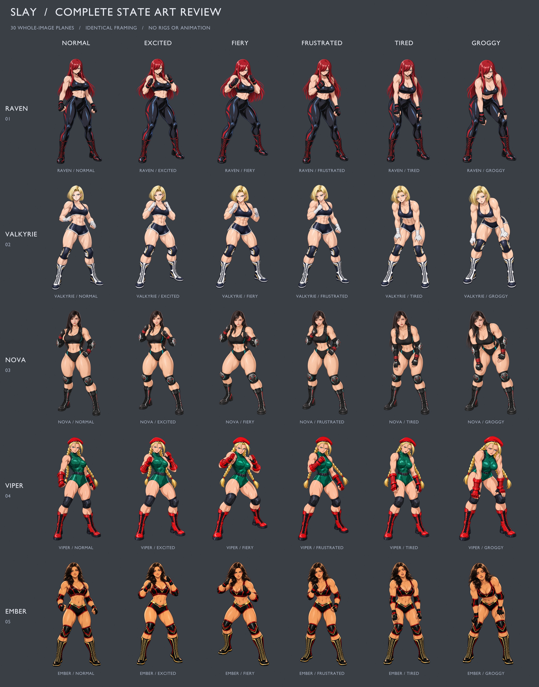

# SLAY | Ring of Nightmares

오리지널 여성 프로레슬링 세계를 배경으로 한 싱글 플레이 덱빌딩 로그라이크 웹게임입니다. 상대의 행동을 읽고 공격과 가드를 연결하며, 관중의 열기로 피니셔를 완성하세요. 심리적 압박은 악몽 카드를 덱에 남깁니다.

[플레이](https://rockyhong-a11y.github.io/slay/) · [선수 선택](https://rockyhong-a11y.github.io/slay/#roster) · [카드 도감](https://rockyhong-a11y.github.io/slay/#cards) · [카드 시스템 도움말](https://rockyhong-a11y.github.io/slay/#guide) · [GitHub](https://github.com/rockyhong-a11y/slay) · [게임 설계](docs/GAME_DESIGN.md)

현재 버전은 **시작부터 챔피언십까지 플레이 가능한 버티컬 슬라이스**입니다. 선수 5명, 카드 25종, 8개 구간과 최종 보스를 구현했습니다. 레이븐은 콤보 타격, 발키리는 가드·잡기, 노바는 드로우·순환, 바이퍼는 약화·취약 제압, 엠버는 관중 열기와 컴백을 활용합니다. 각 선수의 11장 시작 덱과 패시브가 실제 전투 규칙에 연결됩니다.

선수는 참고 이미지의 얼굴·헤어·의상 특징을 반영한 카툰 전신 그림입니다. **보통·흥분·열혈·좌절·지침·그로기, 5명 × 6상태의 완성 일러스트 30장**을 사용합니다. 체력 25% 이하는 그로기, 50% 이하는 지침을 우선 적용하고, 이후 압박 60 이상은 좌절, 열기 6 이상은 열혈, 열기 3–5는 흥분을 표시합니다. 상태 배지를 누르면 기준과 전신 그림·얼굴 확대를 미리 볼 수 있습니다. 선수와 카드 그림은 정적 이미지로 표시됩니다.



[모바일 상태 미리보기](artifacts/slay-state-viper-mobile.jpg) · [데스크톱 상태 미리보기](artifacts/slay-state-viper-desktop.jpg) · [30개 상태 브라우저 검증](artifacts/fighter-state-browser-checks.json)

25종의 전용 카드 그림을 사용하는 기술 시네마틱은 유지합니다. 타격·공중기·던지기·서브미션·잡기·방어·운영·악몽을 구분하며, 실제 피해·방어·회복·드로우·열기·압박 결과를 보여줍니다. 재생 중에는 카드와 턴 종료 입력을 잠그며, 기술 연출은 **전체/간결**로 조절합니다. 운영체제의 모션 감소 설정도 따릅니다.

도감은 이름·효과 검색과 기술 분류·카드 타입·희귀도 필터를 제공합니다. 상세 창에서 기술 설명, 기본·강화 효과, 소멸 여부와 획득 방법을 함께 확인할 수 있습니다.

## 플레이

- 매 턴 기본 에너지 3, 드로우 5장. 카드의 순서를 설계합니다.
- 공격 콤보 2회마다 열기 1을 얻습니다. 열기 3을 소모하여 피니셔를 사용합니다.
- 상대의 공격·가드·도발이 미리 공개됩니다. 회복 카드와 명상으로 압박을 관리합니다.
- 승리 후 카드 보상을 고르고 경기·정예·휴식·상점·이벤트 경로를 선택합니다.
- 선수 선택에서 다섯 선수의 전략, 패시브, 시작 덱과 추천 카드를 비교합니다.

| 조작                | 동작                        |
| ------------------- | --------------------------- |
| 카드 클릭 / `1`–`9` | 해당 카드 플레이            |
| `0`                 | 10번째 카드 플레이          |
| `Space`             | 턴 종료                     |
| `Esc`               | 창 닫기 / 아레나로 돌아가기 |

진행은 브라우저 `localStorage`에 자동 저장됩니다. 새 런은 현재 진행을 교체합니다.

## 실행

Node.js 24 환경을 권장합니다.

```sh
npm install
npm run dev
npm test
npm run build
npm run preview
```

`build`는 `dist/`에 배포 파일을 생성합니다. 최종 테스트 45개와 배포 빌드가 통과했습니다. 테스트는 전투·저장·다섯 선수의 8구간 완주, 도감·강화 설명, 상태 우선순위, 30개 상태 이미지와 카드 시네마틱 결과를 검증합니다. [전환 검증 기록](artifacts/cartoon-fighter-qa.md)과 [아레나 체크리스트](artifacts/arena-layout-checklist.md)를 포함합니다.

## 아트와 라이선스

최종 상태 그림 30장은 내장 이미지 생성 도구의 개별 편집 호출로 제작했습니다. 기존 카툰 전신과 원본 얼굴 참고를 함께 사용하고, 보정한 보통 상태를 기준으로 나머지 표정·자세를 제작했습니다. 배포 파일은 투명 배경의 1000×1500 WebP입니다. [보통 상태 4장](artifacts/fighter-state-prompts.json) · [변형 상태 20장](artifacts/fighter-state-variant-prompts.json) · [바이퍼 6장](artifacts/viper-state-prompts.json)에 정확한 프롬프트와 생성 경로를 기록했습니다.

수정 가능한 [Blender 아레나 장면](artifacts/arena.blend)과 [렌더 스크립트](tools/render-arena.py)를 포함합니다. 30개 완성 이미지를 비교하는 [Blender 검수 갤러리](artifacts/fighter-state-gallery.blend), [구성 검증 기록](artifacts/fighter-state-gallery-facts.json), [갤러리 스크립트](tools/build-state-gallery.py)도 함께 제공합니다. 갤러리는 각 완성 그림을 하나의 이미지 평면에 표시합니다.

최종 선수 그림은 `public/assets/fighters/states/`, 카드 그림은 `public/assets/cards/`에 있습니다. [전체 아트 제작 기록](artifacts/art-direction.md)에서 출처를 구분합니다. 사용자 제공 원본 참고 파일은 저장소에 배포하지 않습니다.

소스 코드는 [MIT](LICENSE)입니다. 생성·렌더 에셋의 제작 출처는 별도로 기록하며, 코드 라이선스는 참고 이미지의 재사용 권리를 부여하지 않습니다.

글꼴은 로컬에 번들링합니다. Do Hyeon은 한국어 제목, Teko는 수치, Barlow Condensed는 선수 이름과 영어 표기, Noto Sans KR은 규칙·효과 설명을 맡습니다. SIL Open Font License: [Do Hyeon](public/assets/licenses/DoHyeon-OFL.txt) · [Teko](public/assets/licenses/Teko-OFL.txt) · [Barlow Condensed](public/assets/licenses/BarlowCondensed-OFL.txt) · [Noto Sans KR](public/assets/licenses/NotoSansKR-OFL.txt).

## Technical appendix

The client uses React, Vite, Motion, and Phosphor icons. Gameplay lives in the dependency-free ES module [`src/game.js`](src/game.js). The UI owns image presentation, audio, keyboard input, and browser persistence. [`src/presentation.js`](src/presentation.js) selects fighter conditions, maps each condition to a complete WebP illustration, and derives cinematic outcomes from engine snapshots. [`src/Artwork.jsx`](src/Artwork.jsx) displays those complete images and crops portraits from the same file. Presentation never changes combat or saved state.

Character assets use `fighters/states/{actor}-{state}.webp`. The five actors are `raven`, `valkyrie`, `nova`, `viper`, and `ember`; the six states are `normal`, `excited`, `fiery`, `frustrated`, `tired`, and `groggy`. Cards retain their 25 dedicated `cards/{id}.webp` illustrations. The app renders completed images rather than continuous canvas rigs; finite card-cast transitions remain.

Every engine action returns a cloned, serializable state. Invalid actions return the original state. A saved PRNG seed makes draw order, encounters, and rewards reproducible after loading. Card instances use `{ uid, id, upgraded }`; permanent deck entries and combat piles share the same logical UID.

```js
import { newRun, playCard, endTurn, chooseReward } from "./src/game.js";

let run = newRun("raven", 12345);
run = playCard(run, run.hand[0].uid);
if (run.phase === "combat") run = endTurn(run);
if (run.phase === "reward") run = chooseReward(run, run.rewards[0]);
```

See [the engine API and design notes](docs/GAME_DESIGN.md#engine-api) for the full phase flow and browser-local save format.
