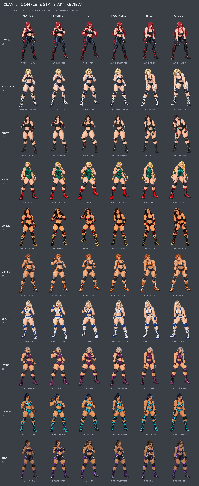

# SLAY | Ring of Nightmares

오리지널 여성 프로레슬링 세계를 배경으로 한 싱글 플레이 덱빌딩 로그라이크 웹게임입니다. 상대의 행동을 읽고 공격과 가드를 연결하며, 관중의 열기로 피니셔를 완성하세요. 심리적 압박은 악몽 카드를 덱에 남깁니다.

[플레이](https://rockyhong-a11y.github.io/slay/) · [선수 선택](https://rockyhong-a11y.github.io/slay/#roster) · [카드 도감](https://rockyhong-a11y.github.io/slay/#cards) · [카드 시스템 도움말](https://rockyhong-a11y.github.io/slay/#guide) · [GitHub](https://github.com/rockyhong-a11y/slay) · [게임 설계](docs/GAME_DESIGN.md)

현재 버전은 **시작부터 챔피언십까지 플레이 가능한 버티컬 슬라이스**입니다. 선수 10명, 카드 60종, 웨이브마다 38개 노드·6개 레인으로 분기하는 8개 구간, 총 3웨이브·24구간과 초·중·고급 보스를 구현했습니다. 레이븐은 콤보 타격, 발키리는 가드·잡기, 노바는 드로우·순환, 바이퍼는 약화·취약 제압, 엠버는 관중 열기와 컴백을 활용합니다. 신규 아틀라스는 고비용 파워 기술, 세라프는 공중기·순환, 링스는 관절기·압박 관리, 템페스트는 잡기 콤보, 오닉스는 방어와 카운터를 활용합니다. 각 선수의 11장 시작 덱과 패시브가 실제 전투 규칙에 연결됩니다. 선수 선택에는 신규 5명 필터가 있습니다.

기존 선수는 참고 이미지의 얼굴·헤어·의상 특징을 반영한 카툰 전신 그림이며, 신규 5명은 기존 선수들의 체형과 렌더링 스타일에 맞춘 오리지널 선수입니다. **보통·흥분·열혈·좌절·지침·그로기, 10명 × 6상태의 완성 일러스트 60장**을 사용합니다. 체력 25% 이하는 그로기, 50% 이하는 지침을 우선 적용하고, 이후 압박 60 이상은 좌절, 열기 6 이상은 열혈, 열기 3–5는 흥분을 표시합니다. 상태 배지를 누르면 기준과 전신 그림·얼굴 확대를 미리 볼 수 있습니다. 원본 모드의 선수와 카드 그림은 완성된 전신·기술 일러스트를 사용합니다. 바이퍼의 여섯 상태에서 베레모와 건틀릿을 제거하고 맨손·맨팔로 수정했습니다.

노바의 여섯 상태는 레이븐·바이퍼와 어울리는 **선명한 윤곽선과 셀 셰이딩의 카툰 얼굴**로 다시 제작했습니다. 검은 옆가르마 머리·귀걸이·기존 복장과 체형을 유지하며, 각 상태의 표정과 자세가 한 장의 연결된 전신 그림에 담깁니다.

전체 열 명 선수의 여섯 상태에 **땀·찰과상·멍·작은 혈흔**을 추가했습니다. 열기와 압박이 높거나 체력이 낮으면 땀이 늘고, 체력 70% 이하부터 찰과상, 50% 이하부터 멍, 25% 이하부터 눈썹의 작은 혈흔이 나타납니다. 체력 10% 이하에서는 입가에도 혈흔을 표시합니다. 체력 회복에 따라 표현도 완화되며, 상태 미리보기에서는 해당 상태의 예시를 보여줍니다. 전신과 얼굴 확대에 같은 위치를 적용하고, 기존 완성 그림 전체에 장식을 얹으므로 얼굴·팔·몸을 분리하지 않습니다.

피부에는 기본 광택을 더하고, 운동량에 따라 작은 투명 땀방울과 얇은 흐름·반사광을 겹칩니다. 파란 궤적·전기선·바닥 고리는 제거하고, 엘보와 같은 흰색·금색 접촉 섬광과 먼지·파편으로 통일했습니다.

**원본 / SD 2D 전환**은 경기장 하단, 설정, 선수 화면에서 사용할 수 있으며 선택을 저장합니다. SD 선수 10명은 각 3개의 완성 전신 포즈(대기·공격·피격)를 새로 그렸습니다. 그림 전체를 이동·회전하며 타격의 돌진·짧은 정지·넉백, 던지기의 들어올림·낙하, 서브미션의 낮은 홀드를 구분합니다. 몸의 파트를 분리하지 않으며, SD 그림이나 포즈 영역 정보를 불러오지 못하면 원본 그림으로 돌아갑니다. 모드 변경은 현재 덱·체력·진행에 영향을 주지 않습니다.

[SD 2D·피부 광택·접촉 효과 검수](artifacts/sd-2d-qa.md) · [이전 땀·상처 검증](artifacts/condition-arcade-qa.md)



[세로 겹친 손패](artifacts/journey-fan-393x852.jpg) · [가로 겹친 손패](artifacts/journey-fan-667x375.jpg) · [확대 기술 연출](artifacts/journey-technique-focus.jpg) · [분기 지도](artifacts/journey-road.jpg) · [라커룸 컷신](artifacts/journey-lockerroom.jpg) · [10개 화면 조건 검증](artifacts/journey-fan-geometry.json) · [바이퍼 6상태 검증](artifacts/viper-no-gear-browser-checks.json)

60종의 전용 카드 그림을 사용하는 기술 시네마틱을 제공합니다. 새 기술 25종은 파워밤 5종, 슬램·수플렉스 7종, 관절기·서브미션 10종, 잡기 연결 3종입니다. 각 카드의 유한 애니메이션 효과를 추가했습니다. 타격은 방향 잔상과 접촉 폭발, 그래플링은 조임·들어 올림·낙하와 매트 충격파, 서브미션은 관절 타깃과 지속 압박으로 차별화합니다. 타격·공중기·던지기·서브미션·잡기·방어·운영·악몽을 구분하며, 실제 피해·방어·회복·드로우·열기·압박 결과를 보여줍니다. 재생 중에는 카드와 턴 종료 입력을 잠그며, 기술 연출은 **전체/간결**로 조절합니다. 운영체제의 모션 감소 설정도 따릅니다.

[사용자가 제공한 연출 참고 영상](https://www.youtube.com/watch?v=0QHrqt6sGJY)을 바탕으로 기술 시네마틱과 링 위 피격 효과를 아케이드 스타일로 재작업했습니다. 타격에는 방향 잔상과 따뜻한 접촉 섬광, 던지기에는 매트 충돌·먼지·파편, 서브미션에는 관절 부위의 작은 압박 섬광을 사용합니다. 방어는 옅은 금색 접촉 표시, 운영은 회복·집중 광원, 악몽은 어두운 붉은 효과로 구분합니다. 접촉 순간의 짧은 정지와 선수 그림 전체의 반동을 연결하며, 실제 피해와 가드·KO 판정을 표시합니다. 소리를 켜면 같은 접촉 시점에 타격음·매트 충돌음·조임 펄스·방어음도 재생됩니다. 모션 감소 또는 간결 설정에서는 움직임과 입자를 줄이고 결과를 정적으로 표시합니다.

경기 배경은 **언더그라운드 클럽·네온 돔·그랜드 스타디움·크라운 콜로세움 4종**입니다. 촘촘한 관중, 다층 발코니, 링사이드 장비와 조명을 담은 1536×1024 그림을 웨이브와 구간에 따라 배치합니다. 기술 접촉 순간에는 환호·기립 환호·술렁임·탭아웃 구호·야유·박수가 실제 판정에 맞춰 나타나며, 관중의 팔과 조명이 반응합니다. 소리를 켜면 관중 소음과 박수·야유 음향도 함께 재생됩니다. 피니셔와 KO는 기립 환호, 완전 방어는 술렁임, 상대 타격·도발과 일부 도구는 야유로 구분합니다.

도감은 이름·효과 검색과 기술 분류·카드 타입·희귀도 필터를 제공합니다. 상세 창에서 기술 설명, 기본·강화 효과, 소멸 여부와 획득 방법을 함께 확인할 수 있습니다.

**기존 관절기·잡기 8종을 유틸리티 카드로 전환**했습니다. 헤드록·암바·앵클 록은 드로우, 기무라 록·힐 훅·칼라 앤 엘보는 다음 카드 비용 감소, 아메리카나 록·리어 웨이스트록은 행동력 회복을 중심으로 구성했습니다. 각 카드에 3가지 강화 방향을 제공하며 공격형 관절기도 함께 유지합니다. 할인은 이번 턴의 다음 기본 비용 1 이상 카드 한 장에 적용하고, 손패에 실제 비용을 표시합니다. 행동력·할인 공급 카드는 소멸합니다. 도감의 유틸리티 필터와 도움말에서 확인할 수 있습니다. [8종·24강화 효과와 검증 기록](artifacts/utility-cards-qa.md)

**새 카드 10종을 추가해 전체 60종, 유틸리티 18종으로 확장**했습니다. 리스트록·해머록·오모플라타·옥토퍼스 홀드·서프보드 스트레치·STF·토 홀드·카프 슬라이서·보우 앤 애로·앱도미널 스트레치는 각각 전용 2D SD 캐릭터 그림을 사용하는 새로운 카드입니다. 기존 8종의 전환과 별개로 카드마다 3개의 전용 강화, 총 30개 방향을 추가했습니다. 직접 피해 없이 드로우·행동력·할인·방어·제압·열기로 다음 플레이를 준비하며, 일반 경기 보상과 상점에서 획득합니다. 열 명 선수의 기존 시작 덱은 그대로이고, 링스는 새 10종에서도 턴당 첫 관절기 효과를 받습니다. [신규 10종·30강화와 엔진 검증](artifacts/sd-utility-qa.md)

세로·가로 단말에서는 전투 영역과 패를 화면 높이에 맞춥니다. 최대 10장의 손패를 겹쳐 한 화면에 모으고, 손패 위를 누른 채 좌우로 드래그하면 한 장씩 상승·강조합니다. 한 번 탭해 선택하고, 같은 카드를 빠르게 두 번 탭해 사용합니다. 화면 전체는 고정되며 긴 지도·도감·도움말과 상세 창만 내부에서 스크롤합니다. 게임 안의 텍스트 롱프레스 팝업과 더블탭 확대도 차단합니다. 기술 사용 시 큰 장면으로 확대하고 배경을 흐리게 처리하며, 파워밤의 들어 올림·낙하, 슬램의 충돌, 관절기의 압박에 맞춰 카메라 이동과 효과를 구분합니다. 완성된 선수 그림 전체의 돌진·피격 밀림, 접촉 순간의 짧은 정지, 충격선과 방어 판정으로 대전격투의 타격감을 표현합니다.

아레나는 **루키 → 컨텐더 → 챔피언, 총 3웨이브**입니다. 각 웨이브의 지도는 **38개 노드·6개 레인**으로 구성됩니다. **1·3·5·7구간은 필수 전투**이므로 웨이브 보스 전에 최소 4경기, 최종 완주까지 보스 포함 최소 15경기를 치릅니다. 2·4·6구간에는 회복·상점·백스테이지와 추가 전투가 있어, 준비와 추가 보상 중 선택합니다. 일반전 35, 정예전 65, 하드코어 쇼다운 95 크레딧입니다. 쇼다운은 정예 상대의 체력 20%와 공격력 2를 더하는 대신 레어 카드 4장 중 선택과 아이템·코너 기믹 확정 보상을 제공합니다. 현재 위치의 같은 레인과 인접 레인으로만 이어지므로 앞으로 필요한 준비 장소도 함께 고려하세요.

웨이브 보스는 **IRON REGENT(초급) → SABLE QUEEN(중급) → EMPRESS(고급)**로 바뀌며, 체력·공격뿐 아니라 방어·도발·연속 공격의 행동 순서도 다릅니다. 첫 두 보스 승리 뒤 정비 화면에서 다음 웨이브로 넘어가면 최대 체력의 35% 회복과 압박 25 감소를 받습니다. 덱·강화·크레딧·미사용 물품은 유지하고, 지도와 경기 상태만 새로 시작합니다. 마지막 보스 승리에서 완성 덱을 보관할 수 있습니다.

각 웨이브 보스를 제압하면 **루키(브론즈)·컨텐더(실버)·월드(골드) 챔피언 벨트**를 수여합니다. 보스 기술·타격 연출이 끝난 뒤 스테이지 종료 화면에 획득 벨트를 크게 표시하고, 코너 보관함의 **챔피언 벨트 컬렉션**에 우승 선수와 함께 기록합니다. 우승 벨트는 새 런에서도 유지되는 수집 보상이며, 경기 효과를 주는 레플리카 장비와 별도로 보관됩니다.

아이템과 유물 대체 기믹은 실제 프로레슬링의 **도구·장비 12종**으로 구성합니다. 1회용 아이템은 메디컬 아이스팩·링벨·폴딩 체어·죽도·링사이드 마이크·레슬링 손목 테이프입니다. **에너지 없이 1회 사용**하며, 쓰지 않은 도구는 다음 경기로 가져갑니다. 코너 기믹은 턴버클 패드·스틸 래더·브레이크어웨이 테이블·링 로프·코너 스툴·레플리카 챔피언 벨트입니다. **다음 경기 전에 하나를 예약하면 그 경기 종료까지 지속**되며, 효과와 대가를 함께 적용한 뒤 소모됩니다. 상점·보상·보관함에서 각각의 전용 도구 그림을 확인할 수 있습니다. 라커룸·백스테이지 이벤트에는 세 종류의 배경과 선수 그림, 대사, 선택 결과를 사용하는 컷신이 있습니다.

상점·락커룸·백스테이지에서 **선택한 카드 1장을 덱에서 영구 제거**할 수 있습니다. 상점은 장소당 1회, 첫 제거 60크레딧이며 이 런에서 유료 제거할 때마다 다음 비용이 20씩 오릅니다. 락커룸·백스테이지에서는 무료로 정리하는 대신 해당 장소의 회복·강화·이벤트 보상 선택을 사용합니다. 같은 카드가 여러 장이어도 선택한 한 장만 제거하며, 최소 5장은 유지합니다.

최종 보스에게 승리한 뒤 **완성 덱을 이름 붙여 최대 20개 보관**할 수 있습니다. 다음 아레나 진입에서는 선수 → 기본 시작 덱 또는 그 선수의 완성 덱 → 진입 순서로 선택합니다. 카드 종류·장수·강화 상태를 유지하고, 체력·크레딧·열기·압박·장비·전투 진행은 새 런의 시작 상태로 초기화합니다. 보관 덱은 현재 런과 별도로 이 브라우저에 저장합니다.

## 플레이

- 매 턴 기본 에너지 3, 드로우 5장. 카드의 순서를 설계합니다.
- 공격 콤보 2회마다 열기 1을 얻습니다. 열기 3을 소모하여 피니셔를 사용합니다.
- 상대의 공격·가드·도발이 미리 공개됩니다. 회복 카드와 명상으로 압박을 관리합니다.
- 승리 후 카드 보상을 고르고 경기·정예·휴식·상점·이벤트 경로를 선택합니다.
- 선수 선택에서 열 명 선수의 전략과 패시브를 비교한 뒤 기본 덱이나 해당 선수의 완성 덱을 고릅니다.
- 상점·락커룸·백스테이지의 카드 영구 제거로 덱을 다듬고, 최종 승리 화면에서 완성 덱을 저장합니다.
- 웨이브 보스마다 챔피언 벨트를 획득하고, 코너 보관함에서 세 가지 우승 기록을 모읍니다.

| 조작                | 동작                                |
| ------------------- | ----------------------------------- |
| 카드 클릭 / 터치    | 카드 선택·확인                      |
| 손패 좌우 드래그    | 한 장씩 상승·강조, 놓으면 선택 유지 |
| 같은 카드 더블탭    | 사용 가능할 때 한 번 자동 사용      |
| 같은 경로 더블탭    | 연결된 경로로 이동                  |
| 선택 카드 사용 버튼 | 선택한 카드 플레이                  |
| `1`–`9`             | 해당 카드 바로 플레이               |
| `0`                 | 10번째 카드 플레이                  |
| `Space`             | 턴 종료                             |
| `Esc`               | 창 닫기 / 아레나로 돌아가기         |

진행은 브라우저 `localStorage`에 자동 저장됩니다. 새 런은 현재 진행을 교체하지만 완성 덱 보관함과 챔피언 벨트 컬렉션은 유지합니다. 덱 보관함은 최대 20개이며 공간이 차면 보관 덱을 직접 삭제해야 합니다. 벨트는 세 종류를 중복 없이 기록하며, 현재 진행·완성 덱과 분리해 저장합니다. 다른 기기·브라우저로 자동 동기화되지 않고, 브라우저 데이터를 삭제하면 진행·보관 덱·벨트 컬렉션도 사라집니다.

## 실행

Node.js 24 환경을 권장합니다.

```sh
npm install
npm run dev
npm test
npm run build
npm run preview
```

`build`는 `dist/`에 배포 파일을 생성합니다. 자동 테스트와 배포 빌드로 변경을 검증합니다. 테스트는 전투·저장·열 명 선수의 8구간 완주, 60종 카드의 기본·강화 사용, 신규 25종의 보상·상점 획득, 도감 설명, 상태 우선순위, 60개 상태 이미지와 카드 시네마틱 결과, 38노드의 모든 경로와 보스 전 최소 4승, 구형 경로 저장의 이전, 선택 카드 영구 제거·비용·최소 장수, 완성 덱 저장·중복 방지·재사용·저장 오류, 모바일 메뉴와 하위 화면 이동, 소모품·기믹 만료·비용·저장 호환, 실제 타격·가드·모션 감소, 드래그·더블탭·롱프레스·멀티터치·중복 사용 방지, 모바일 기본 동작 차단과 내부 스크롤을 검증합니다. 120개의 선수·시드·경로 정책 조합 비교도 포함합니다. [선수 확장·카드 연출 검수](artifacts/roster-technique-expansion-qa.md)와 [모바일 조작 검수](artifacts/mobile-gestures-qa.md)와 [분기·컷신·보급 브라우저 검수](artifacts/journey-browser-qa.md)와 [이전 경로 버전의 위험·보상 비교](artifacts/journey-balance-checks.json)를 제공합니다. [전환 검증 기록](artifacts/cartoon-fighter-qa.md)과 [아레나 체크리스트](artifacts/arena-layout-checklist.md)를 포함합니다.

## 아트와 라이선스

신규 유틸리티 10종의 2D SD 카드 아트 제작 기록은 [그룹 A](artifacts/sd-utility-art-a.json)와 [그룹 B](artifacts/sd-utility-art-b.json)에 보관합니다. 전용 카드 그림은 `public/assets/cards/{id}.webp`로 연결합니다.

SD 2D는 내장 `image_gen`으로 제작한 투명 PNG 10장에 전신 포즈 30개를 담았습니다. [제작 프롬프트](artifacts/sd-2d-prompts.json), [배포 그림](public/assets/sd2d/), [알파·포즈 영역 검수](artifacts/sd2d-atlas-qa.json)를 제공합니다. `tools/inspect-sd-atlas.py`는 픽셀을 변경하지 않고 표시 영역만 측정합니다. Higgsfield 이미지 생성은 연결 계정의 `Requires basic plan or higher.` 제한으로 거절되어 사용하지 않았습니다. Blender 3D 시안은 사용자의 2D 변경 요청에 따라 배포에서 제외했으며, 게임은 WebGL·Three.js·GLB를 불러오지 않습니다.

기존 다섯 선수의 상태 그림 30장은 내장 이미지 생성 도구의 개별 편집 호출로 제작했습니다. 기존 카툰 전신과 원본 얼굴 참고를 함께 사용하고, 보정한 보통 상태를 기준으로 나머지 표정·자세를 제작했습니다. 배포 파일은 투명 배경의 1000×1500 WebP입니다. [보통 상태 4장](artifacts/fighter-state-prompts.json) · [변형 상태 20장](artifacts/fighter-state-variant-prompts.json) · [바이퍼 초기 6장](artifacts/viper-state-prompts.json)에 정확한 프롬프트와 생성 경로를 기록했습니다. 이후 [바이퍼 장비 제거 6장](artifacts/viper-no-gear-prompts.json)을 내장 이미지 편집으로 제작해 현재 배포 파일을 교체했습니다. 신규 카드 25장의 [개별 제작 프롬프트](artifacts/new-card-prompts.json)도 함께 제공합니다.

신규 5명의 전신 이미지 30장은 내장 이미지 생성 도구로 제작했습니다. 각 선수의 보통 상태를 기준으로 나머지 다섯 상태를 개별 편집해 얼굴·체형·장비를 유지했습니다. [신규 선수 프롬프트·출처](artifacts/new-roster-prompts.json)에 모든 생성 호출을 기록합니다. 배포 경로는 기존과 동일한 `public/assets/fighters/states/`입니다.

노바의 카툰 얼굴 수정은 여섯 상태를 각각 내장 이미지 편집으로 재제작했습니다. 투명 배경을 유지한 1000×1500 WebP를 사용하며, [노바 수정 프롬프트·검수](artifacts/nova-cartoon-v2.md)와 [이미지 메타데이터](artifacts/nova-cartoon-v2-metadata.json)에 기록합니다. 생성 원본 PNG는 로컬에 보관하고 저장소 배포에서는 제외합니다.

새 경기장 4종은 내장 이미지 생성으로 제작한 `public/assets/arenas/`의 1536×1024 WebP입니다. [경기장 프롬프트·제작 기록](artifacts/arena-environments.md)에 원본 경로와 구도를 남겼습니다. 프로레슬링 도구 12종과 챔피언 벨트 3종은 각각 `public/assets/equipment/`, `public/assets/belts/`의 전용 SVG 일러스트를 사용합니다.

땀·상처와 아케이드 기술 효과는 직접 작성한 SVG·CSS·Motion 그래픽입니다. 선수·상태별 얼굴과 신체 좌표를 기존 완성 일러스트에 맞춰 배치하며, 피부 표현은 이미지의 투명 영역 밖으로 나가지 않도록 마스킹합니다. 접촉·관중 음향은 Web Audio로 현장에서 합성합니다. 참고 영상의 프레임·음원·게임 리소스를 배포 파일에 복사하지 않습니다.

수정 가능한 [Blender 아레나 장면](artifacts/arena.blend)과 [렌더 스크립트](tools/render-arena.py)를 포함합니다. 60개 완성 이미지를 비교하는 [Blender 검수 갤러리](artifacts/expanded-fighter-state-gallery.blend), [구성 검증 기록](artifacts/expanded-fighter-state-gallery-facts.json), [갤러리 스크립트](tools/build-state-gallery.py)도 함께 제공합니다. 갤러리는 각 완성 그림을 하나의 이미지 평면에 표시합니다.

최종 선수 그림은 `public/assets/fighters/states/`, 카드 그림은 `public/assets/cards/`에 있습니다. 새 컷신 배경은 내장 이미지 생성으로 제작한 `public/assets/events/`의 1600×900 WebP 3장입니다. [컷신 프롬프트와 출처](artifacts/journey-cutscene-prompts.json)와 [전체 아트 제작 기록](artifacts/art-direction.md)에서 제작 경로를 구분합니다. 사용자 제공 원본 참고 파일은 저장소에 배포하지 않습니다.

소스 코드는 [MIT](LICENSE)입니다. 생성·렌더 에셋의 제작 출처는 별도로 기록하며, 코드 라이선스는 참고 이미지의 재사용 권리를 부여하지 않습니다.

글꼴은 로컬에 번들링합니다. Do Hyeon은 한국어 제목, Teko는 수치, Barlow Condensed는 선수 이름과 영어 표기, Noto Sans KR은 규칙·효과 설명을 맡습니다. SIL Open Font License: [Do Hyeon](public/assets/licenses/DoHyeon-OFL.txt) · [Teko](public/assets/licenses/Teko-OFL.txt) · [Barlow Condensed](public/assets/licenses/BarlowCondensed-OFL.txt) · [Noto Sans KR](public/assets/licenses/NotoSansKR-OFL.txt).

## Technical appendix

The client uses React, Vite, Motion, and Phosphor icons. Gameplay lives in the dependency-free ES module [`src/game.js`](src/game.js). The UI owns image presentation, audio, keyboard input, and browser persistence. [`src/presentation.js`](src/presentation.js) selects fighter conditions, maps each condition to a complete WebP illustration, and derives cinematic outcomes from engine snapshots. [`src/Artwork.jsx`](src/Artwork.jsx) displays those complete images and crops portraits from the same file. Presentation never changes combat or saved state.

Character assets use `fighters/states/{actor}-{state}.webp`. The ten actors are `raven`, `valkyrie`, `nova`, `viper`, `ember`, `atlas`, `seraph`, `lynx`, `tempest`, and `onyx`; the six states are `normal`, `excited`, `fiery`, `frustrated`, `tired`, and `groggy`. Cards use their 50 dedicated `cards/{id}.webp` illustrations. The app renders completed images rather than continuous canvas rigs; finite card-cast transitions remain.

[`src/fighter-wear.js`](src/fighter-wear.js) derives cosmetic wear from current vitals and maps decorations to each intact illustration. [`src/ArcadeTechniqueFX.jsx`](src/ArcadeTechniqueFX.jsx) and [`src/ArcadeArenaImpact.jsx`](src/ArcadeArenaImpact.jsx) render finite, outcome-aware technique and ring-contact effects. Reduced motion keeps readable results without the impact motion or particles.

[`src/arena-environments.js`](src/arena-environments.js) selects a stable match venue and derives crowd reactions from resolved outcomes. [`src/arena-audio.js`](src/arena-audio.js) synthesizes optional contact layers, crowd beds, claps and boos locally. Contact and crowd sources have separate bounded lifetimes; mute, tab hiding and unmount stop and disconnect scheduled sources. Championship awards live in the run and are also collected under `slay-championship-belts-v1`; [`src/championship-belts.js`](src/championship-belts.js) validates, migrates and deduplicates those cosmetic records without changing combat balance or saved decks.

Every engine action returns a cloned, serializable state. Invalid actions return the original state. A saved PRNG seed makes draw order, encounters, and rewards reproducible after loading. Card instances use `{ uid, id, upgraded, upgradePath? }`; permanent deck entries and combat piles share the same logical UID. The optional specialization is `force`, `control`, or `flow`; legacy upgraded cards without it retain their original + effects.

```js
import { newRun, playCard, endTurn, chooseReward } from "./src/game.js";

let run = newRun("raven", 12345);
run = playCard(run, run.hand[0].uid);
if (run.phase === "combat") run = endTurn(run);
if (run.phase === "reward") run = chooseReward(run, run.rewards[0]);
```

See [the engine API and design notes](docs/GAME_DESIGN.md#engine-api) for the full phase flow and browser-local save format.
