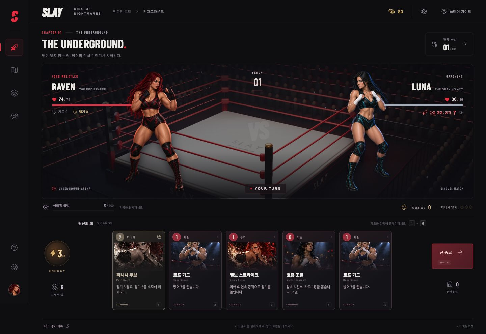
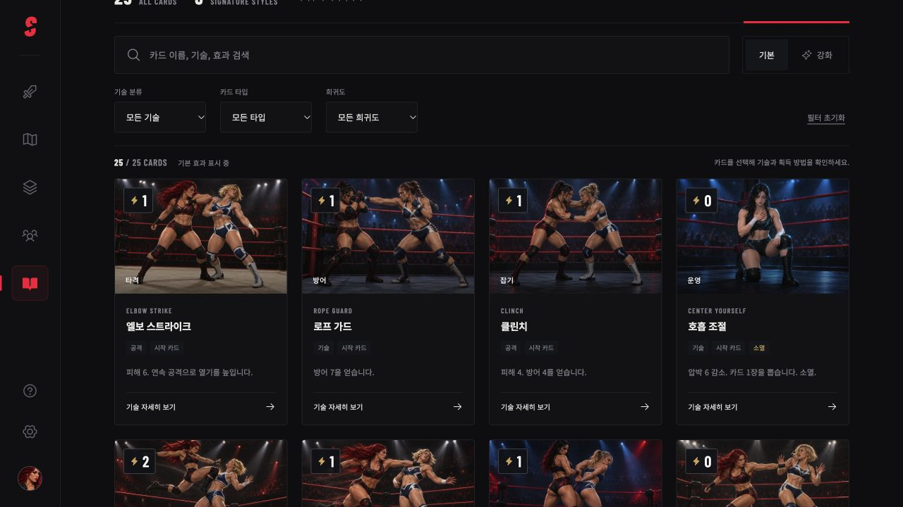

# SLAY | Ring of Nightmares

오리지널 여성 프로레슬링 세계를 배경으로 한 싱글 플레이 덱빌딩 로그라이크 웹게임입니다. 상대의 행동을 읽고 공격과 가드를 연결하며, 관중의 열기로 피니셔를 완성하세요. 심리적 압박은 악몽 카드를 덱에 남깁니다.

[플레이](https://rockyhong-a11y.github.io/slay/) · [카드 도감](https://rockyhong-a11y.github.io/slay/#cards) · [카드 시스템 도움말](https://rockyhong-a11y.github.io/slay/#guide) · [GitHub](https://github.com/rockyhong-a11y/slay) · [게임 설계](docs/GAME_DESIGN.md)



현재 버전은 **시작부터 챔피언십까지 플레이 가능한 버티컬 슬라이스**입니다. 캐릭터 3명, 카드 25종, 8개 구간과 최종 보스가 구현되어 있습니다.

모든 카드에 기술 동작이 드러나는 전용 아트 25장을 적용했습니다. 타격·공중기·던지기·서브미션·잡기·방어·운영·악몽을 구분하며, 도감에서 이름과 효과를 검색하고 기술 분류·카드 타입·희귀도로 필터링할 수 있습니다. 상세 창은 기술 설명, 기본·강화 효과, 소멸 여부와 획득 방법을 함께 보여줍니다. 도움말은 턴 흐름, 카드 더미, 방어와 예고 행동, 콤보·열기, 압박·악몽, 상태 이상과 덱 성장 규칙을 설명합니다.



## 플레이

- 매 턴 기본 에너지 3, 드로우 5장. 공격·방어·드로우 카드의 순서를 설계합니다.
- 공격 콤보 2회마다 열기 1을 얻습니다. 열기 3을 소모하여 피니셔를 사용합니다.
- 상대의 공격·가드·도발이 미리 공개됩니다. 압박은 회복 카드와 명상으로 관리합니다.
- 승리 후 카드 보상을 고르고, 경기·정예·휴식·상점·이벤트 경로를 선택합니다.
- 레이븐의 타격, 발키리의 잡기, 노바의 드로우는 서로 다른 시작 덱과 패시브를 가집니다.

| 조작                | 동작                        |
| ------------------- | --------------------------- |
| 카드 클릭 / `1`-`9` | 해당 카드 플레이            |
| `0`                 | 10번째 카드 플레이          |
| `Space`             | 턴 종료                     |
| `Esc`               | 창 닫기 / 아레나로 돌아가기 |

브라우저 로컬 싱글 플레이 게임이며, 진행은 `localStorage`에 자동 저장됩니다. 새 런은 현재 진행을 교체합니다.

## 실행

Node.js 24 환경을 권장합니다.

```sh
npm install
npm run dev
```

```sh
npm test
npm run build
npm run preview
```

`dev`는 개발 서버, `build`는 `dist/`에 배포 파일을 생성합니다. 테스트 21개는 전투 규칙, 저장 결정성, 카드 더미의 무결성, 세 캐릭터의 실제 완주, 도감의 전체 카드 수록·필터·강화 설명과 25장 전용 WebP의 존재 및 중복 여부를 검증합니다.

## 아트와 라이선스

아레나는 Blender에서 직접 구성하고 렌더했습니다. [렌더 스크립트](tools/render-arena.py)와 수정 가능한 [Blender 장면](artifacts/arena.blend)을 포함합니다. 캐릭터와 카드 아트는 내장 이미지 생성 도구(imagegen)로 제작했습니다. 배포 이미지는 `public/assets/`에 배치합니다. Higgsfield도 시도했으나 검증된 생성 결과를 확보하지 못해 최종 에셋에 사용하지 않았습니다. [제작 기록](artifacts/art-direction.md)을 포함합니다.

소스 코드는 [MIT](LICENSE)입니다. 생성·렌더 에셋의 제작 출처는 위와 같이 별도로 기록합니다. 이 코드 라이선스는 사용자 제공 참고 이미지의 재사용 권리를 부여하지 않으며, 원본 참고 파일은 저장소에 배포하지 않습니다.

## Technical appendix

The client uses React, Vite, Motion, and Phosphor icons. All gameplay rules live in the dependency-free ES module [`src/game.js`](src/game.js). The UI owns rendering, audio, keyboard input, and browser persistence.

Every engine action returns a cloned, serializable state. Invalid actions return the original state. A saved PRNG seed makes draw order, encounter selection, and rewards reproducible after loading. Card instances use `{ uid, id, upgraded }`; permanent deck entries and combat piles share the same logical UID.

```js
import { newRun, playCard, endTurn, chooseReward } from "./src/game.js";

let run = newRun("raven", 12345);
run = playCard(run, run.hand[0].uid);
if (run.phase === "combat") run = endTurn(run);
if (run.phase === "reward") run = chooseReward(run, run.rewards[0]);
```

See [the engine API and design notes](docs/GAME_DESIGN.md#engine-api) for the complete phase flow and browser-local save format.
