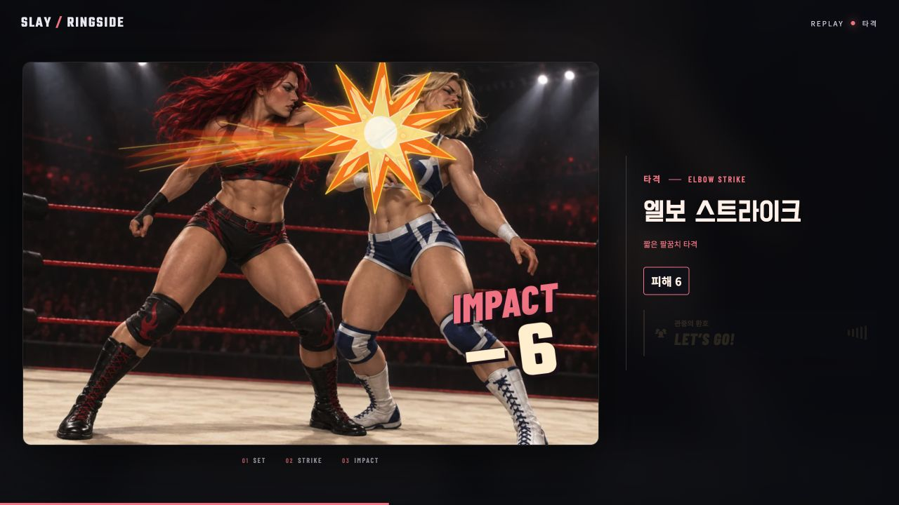
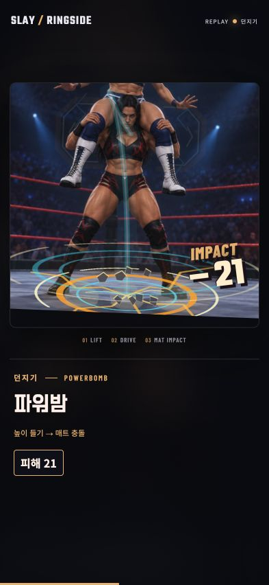
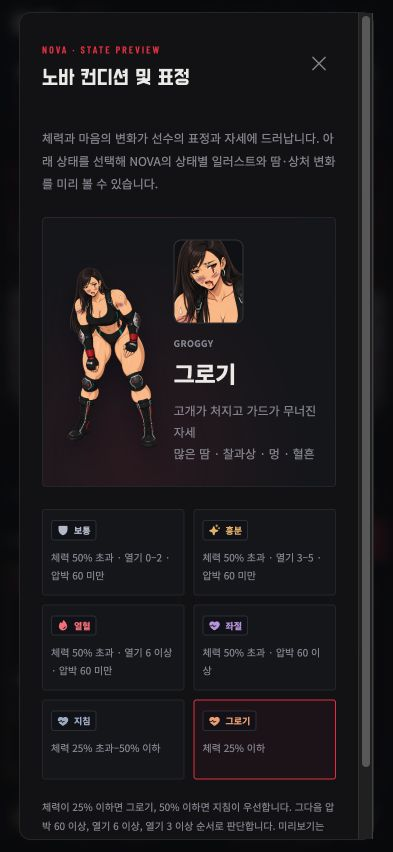

# Condition wear and arcade effects — 2026-10-06

## Delivered

- All ten wrestlers × six poses: registered sweat, abrasion, bruise and small blood overlays, shared by full figures and cropped portraits. Current HP, heat and pressure drive the presentation; healing removes injury marks. See [wear provenance](fighter-wear-provenance.md).
- All 50 card profiles retain their individual contact/joint coordinates. New fire strikes, electric joint locks, grounded pressure, lift trails, mat rings, cracks, dust and debris distinguish technique families. Guard, focus and nightmare also have their own effects.
- Finite whole-illustration recoil, 80–100 ms physical hitstop, damage/guard/KO scores and optional contact audio. No character parts are cut apart. Card camera and effect tracks share a linear normalized clock; this fixes native animation easing moving the light burst ahead of the actual contact.
- Responsive throw camera follows the mat at landing so the impact remains visible in portrait and landscape. Original calibrated contact points stay attached to the artwork.
- Condition guide opens at the current match condition and health. Roster previews still open in normal state. Atlas/Lynx tired and groggy portrait framing was corrected.

## Reference inspected

[WWE 2K BATTLEGROUNDS — Gameplay (PC/UHD)](https://www.youtube.com/watch?v=0QHrqt6sGJY), SergiuHellDragoonHQ, 10:12. Viewed in the browser at 2:02, 3:03, 4:04, 6:07 and 8:09. Useful observations included forceful throw recoil, cyan floor energy, orange flaming fists, electric arcs and localized contact sparks. This implementation is original SVG/CSS/Motion and synthesized Web Audio over the game's existing illustrations. No video frames, audio or third-party game assets were copied.

## Verification

- `npm test`: **228 passed, 0 failed**. Covers all 60 pose anchors, health thresholds and recovery, portrait/mirror geometry, all 50 card effect profiles and their finite timing, real damage/guard outcomes, contact hold, responsive throw-camera interpolation, and bounded audio lifecycle/cleanup.
- `BASE_PATH=/slay/ npm run build`: passed. Production JS contains none of `qaHand`, `qaCondition`, `qaJourney` or `qa-hand-`.
- `git diff --check`: passed.
- Browser sizes: 1280 × 720 desktop, 393 × 852 portrait and 844 × 390 landscape. Full hand and both characters remain in the game viewport; portrait document and body measured exactly 393 × 852 without overflow.
- All ten groggy full figures and portraits inspected; Atlas/Lynx tired rechecked. Nova at 5/68 HP shows brow and lip traces in the current-state guide. Normal previews remove all wear overlays.
- Actual card casts checked: strike, headlock, armbar and powerbomb. Strike light, sparks and audio share the contact clock; powerbomb floor rings remain visible on desktop and portrait.
- Enemy attack, full guard and KO paths checked. Full guard preserves HP and shows absorbed damage. Boss defeat finishes its cue and then opens the bronze belt award. Advancing to Wave 2 restores the battle controls and carries the run forward.
- Settings → concise presentation: 650 ms static cue, zero moving particles, result retained, controls released. Error/warning console logs: empty.

Browser checks use isolated development fixtures; production run progress is not advanced. These are browser viewport checks, not physical iPhone/Safari testing or a complete accessibility audit.

## Representative captures

