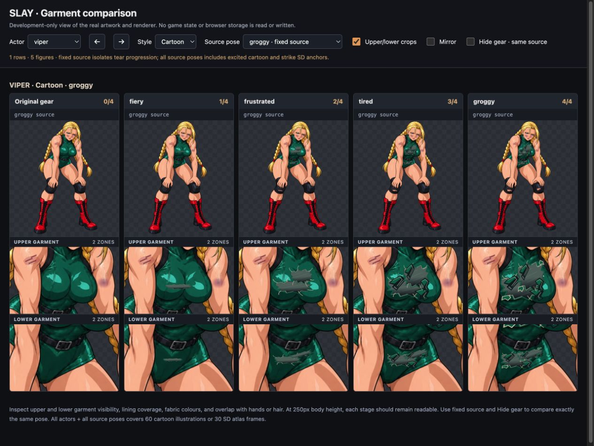
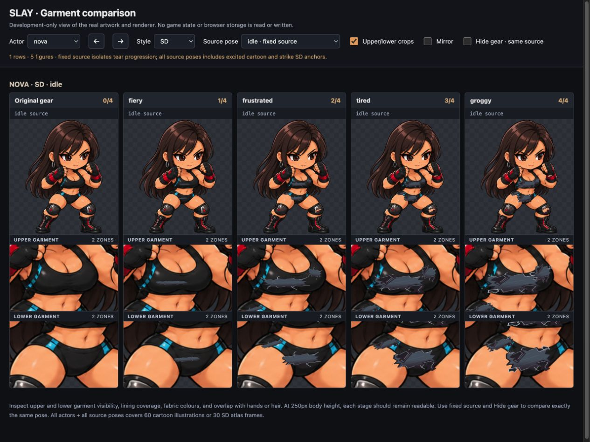
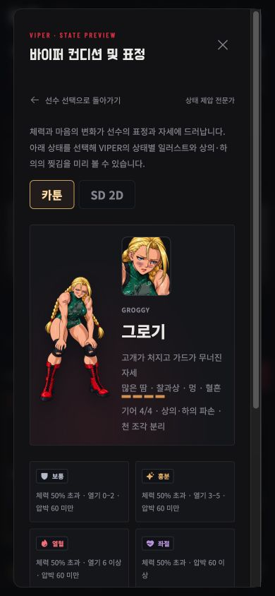

# Torn tops and bottoms — 2026-10-07

This revision addresses the earlier implementation concentrating damage on knee pads. It adds four explicitly authored garment patches per source pose: two upper and two lower. All ten actors are covered in cartoon (60 poses) and SD (30 frames), totaling 360 new garment patches.

Both upper and lower main patches activate at fiery level 1; secondary patches activate at frustrated level 2. Each opening grows through levels 3 and 4, with frayed threads, shaded folded fabric and separated cloth fragments. The top and bottom progress together. Core garment patches expose opaque athletic lining, never skin or transparency. Original image coverage remains underneath; no source sprite pixels or limbs are removed.

Garment fabrics have separate colours from knee pads and boots: Viper remains emerald, Nova's gear uses its dark/cyan materials, and Seraph's light panels keep their own colours. Lining and fold gradients add depth, while neutral thread edges avoid glowing effect outlines.

The existing per-match peak tracking, saves, healing behaviour, mode switching and next-match reset are unchanged. Wear remains cosmetic and does not alter card costs, damage, energy, or deck state. The state guide now explicitly describes tops and bottoms.

## Review fixture

`artifacts/garment-review.html` and `tools/dev-gear-review.jsx` provide an independent Vite-only visual inspection entry. They mount the real `Artwork`, `SDArtwork` and `GearWearOverlay` components with fixed-source levels 0–4, upper/lower crops, actor/pose selection, mirroring and a hide-gear switch. They do not load the app or access saved runs and are not included in the production build.

Examples on the local development server:

- `/artifacts/garment-review.html?actor=viper&style=classic&pose=groggy`
- `/artifacts/garment-review.html?actor=nova&style=sd&pose=idle`
- `/artifacts/garment-review.html?actor=all&style=classic&pose=all&crops=0`
- `/artifacts/garment-review.html?actor=all&style=sd&pose=all&crops=0`

Fixed-source comparison keeps the exact same drawing and pose while changing only garment wear. This exposes misplaced patches over hands, bare skin or hair that a silhouette mask alone could not catch.

## Validation

- `npm test`: 314 passed, zero failures. Includes every actor/style/condition renderer, unique SVG masks and gradients, pose bounds, paired upper/lower progression, SD mirroring, and existing match persistence.
- `BASE_PATH=/slay/ npm run build`: passed. Production entry remains independent of the review fixture.
- Browser DOM audit: all 60 cartoon source poses and 30 SD frames across levels 0–4 (450 figures) have the expected paired garment patches. Level 0 has none, level 1 has one upper and one lower, and levels 2–4 have two of each. Every garment opening uses opaque lining. Details: [browser results](garment-browser-qa.json).
- Visual review: source-pose garment placement reviewed in close-up, with final fixed-pose comparisons for Viper cartoon and Nova SD. Core coverage remains opaque; arms and body are not cut apart.
- Actual game condition guide checked at 390×844 and 844×390, including maximum wear and cartoon/SD switching. No new runtime errors in the game. The development-only comparison entry now reuses its React root during HMR to avoid duplicate-root warnings while editing.

