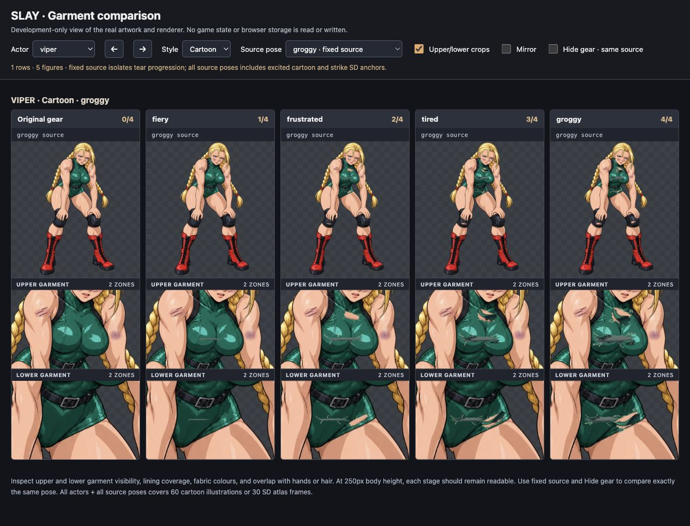
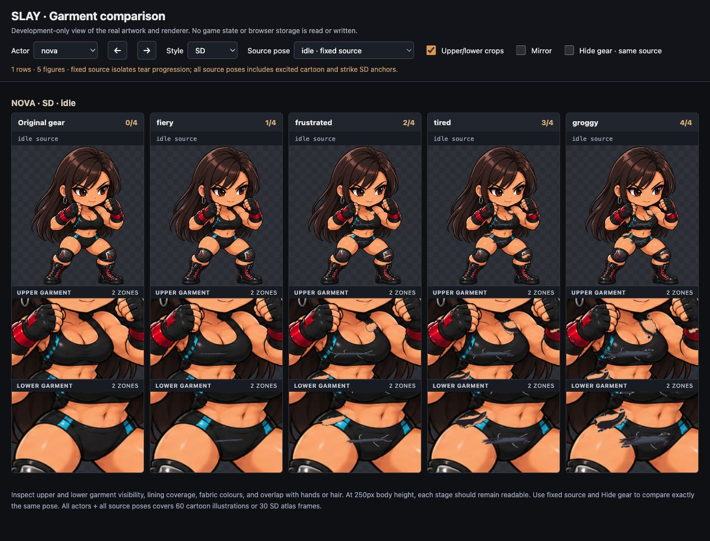
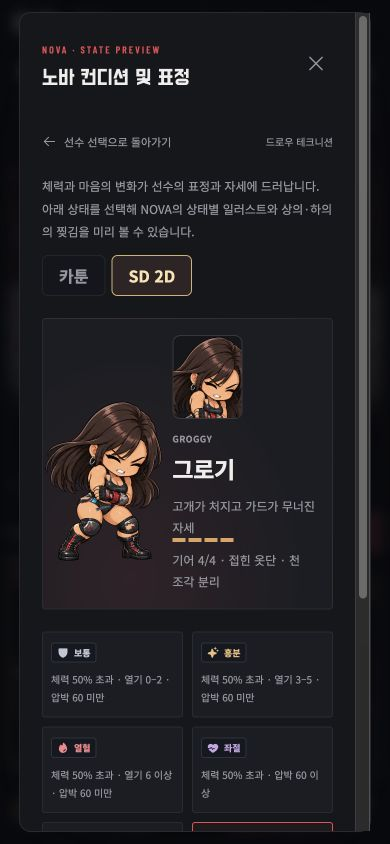

# Side openings, released straps, and folded hems — 2026-10-07

This revision replaces the previous all-lining garment treatment with authored side skin openings and released clothing edges. Earlier verification remains in the [garment report](garment-wear-qa.md) and [original gear report](gear-wear-qa.md); those results apply to their respective earlier revisions.

## Implemented presentation

- All ten actors, across 60 cartoon source poses and 30 SD atlas frames, retain upper and lower garment damage.
- Authored openings along the neckline, side chest, side abdomen, and front outer hip reveal local skin beneath torn cloth. The main chest and central pelvis remain covered by the original garment and opaque athletic lining.
- Damage increases through fiery, frustrated, tired, and groggy. Levels 3 and 4 show a strap released on one side and hems bent away from the garment, with frayed threads and separated cloth fragments.
- Each opening, strap, and fold follows the source pose, actor materials, image crop, mirroring, and movement. Original sprites remain complete.
- Wear stays cosmetic. Healing retains the match peak; style switching and save/reload preserve it; entering the next match resets it to the new starting condition.

## Validation

- `npm test`: **315 passed, zero failures**. Coverage includes all cartoon/SD anchor sets, rotated bounds, warm skin colours, two lined plus two skin panels, deformation direction, exact sprite crops, portrait/mirror registration, retained wear after healing, and existing save/next-match progression.
- Renderer checks include independent gradient/mask IDs and resolved SVG references, no released edge at levels 1/2, loosened edges at level 3, hanging edges at level 4, and a healed normal pose with retained level 4 and left-facing release.
- `BASE_PATH=/slay/ npm run build`: passed. `git diff --check`: passed.
- Browser audit: **60 cartoon poses + 30 SD frames, each at levels 0–4 = 450 figures**. All have zero patches at level 0, two lined panels at level 1, two additional skin panels from level 2, and two released edges at levels 3/4. SD frames all report ready. [Audit data](skin-gear-browser-qa.json).
- Source/outline placement review covered all actor poses. Final rendered close-ups covered Viper cartoon groggy, Raven cartoon groggy, Nova SD idle, Valkyrie SD idle, and mirrored Nova SD hurt. Narrow straps remain narrower than the adjacent arm, while high-neck clothing uses neckline/seam openings.
- Actual SD condition guide checked at 390×844 and 844×390; maximum-wear layers and labels remain attached to the character. Browser runtime errors/warnings: none during final checks. Existing match logic and layout code were not changed.

## Visual review route

Use the independent development fixture at `artifacts/garment-review.html`. It renders the real artwork components without reading or writing saved runs. Select a fixed source pose and compare levels 0–4 with upper/lower crops; use the hide-gear switch to inspect exactly the same drawing.

- Cartoon sweep: `/artifacts/garment-review.html?actor=all&style=classic&pose=all&crops=0`.
- SD sweep: `/artifacts/garment-review.html?actor=all&style=sd&pose=all&crops=0`.
- Close review: select one actor, enable crops, and inspect tired/groggy cartoon poses plus SD attack/hurt frames. Check both normal and mirrored orientation.
- Confirm readability at the fixture's 250px body height, then verify the actual game condition guide and battle sprites at mobile dimensions.

Source-alpha masking cannot distinguish foreground hands or hair from clothing. Those overlap cases need direct visual inspection in addition to numeric bounds checks.

## Evidence

